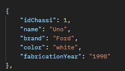

# CarStore API RestFull
The CarStore API is a CRUD (Create, Read, Update, Delete) API designed to manage car information. It allows you to perform basic operations on a collection of cars, including creating new car entries, retrieving car details, updating car information, and deleting cars. This documentation provides information on how to use the API effectively.

## Technologies Used

     
     
      

 

## Response preview

## Endpoints
### **GET** `api/car`: Get a list of all registered cars.

### **GET** `api/car/{id}`: Get a specific car by its ID.

### **PUT** `api/car/cars/{id}`: Update a registered car.

### **POST** `api/car/cars`: Register a new car.

### **DELETE** `api/car/{id}`: Delete a registered car by its ID.

## Error Handling
The API uses HTTP status codes to indicate the success or failure of a request. If an error occurs, the response will contain a JSON object with an error field providing additional details.

In all EndPoints, an error message will be sent if any of the values sent are null or empty. The error will consist of, for example: 400 BAD REQUEST "The 'model' field cannot be null."

In the PUT, DELETE, and GET (by ID) methods, the IDs sent must be valid chassis IDs that are already registered in the database. Otherwise, an error message will be sent. In this case, the message will consist of: 404 NOT FOUND "Car not found. Enter a valid chassis ID."

In the POST method, only the values "Chevrolet, Volvo, BMW, and Ford" in the 'brand' field are accepted, with the first letter capitalized and the others in lowercase. If a different value is passed, an 404 error message indicating that the sent value is not valid will appear.

The 200 OK response will indicate that the operations were successful.
## Car Object
A car object in the API has the following attributes:

chassiId (Long): A unique identifier for the car.

model (String): The name of the car.

brand (String): The brand of the car.

color (String): The color of the car.

fabricationYear (String): The year of fabrication of the car.
