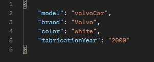

# CarStore API RestFull
The CarStore API is a CRUD (Create, Read, Update, Delete) API designed to manage car information. It allows you to perform basic operations on a collection of cars, including creating new car entries, retrieving car details, updating car information, and deleting cars. This documentation provides information on how to use the API effectively.

## Technologies Used

     
     
      

 

## Response preview

## Endpoints
**GET** `api/car`: Get a list of all cars. 

**GET** `api/car/{id}`: Get a specific car by its ID.

**PUT** `api/car/cars`: Update a registered car.

**POST** `api/car/cars`: Register a new car.

**DELETE** `api/car/{id}`: Delete a registered car by its ID.

## Error Handling
The API uses HTTP status codes to indicate the success or failure of a request. If an error occurs, the response will contain a JSON object with an error field providing additional details.

## Car Object
A car object in the API has the following attributes:

chassiId (Long): A unique identifier for the car.

name (String): The name of the car.

brand (String): The brand of the car.

color (String): The color of the car.

fabricationYear (String): The year of fabrication of the car.

#### Example Response:

